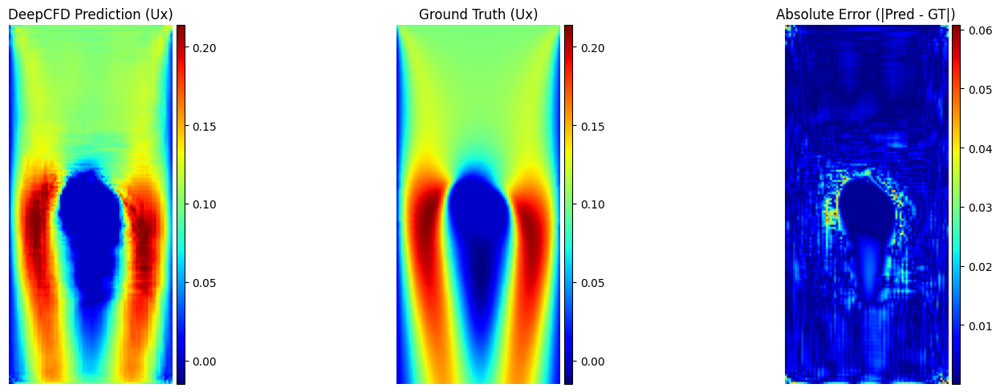
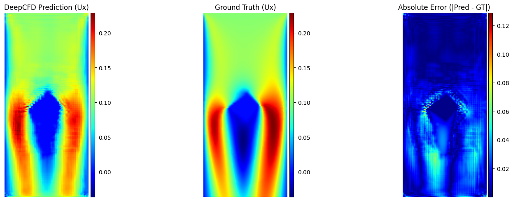
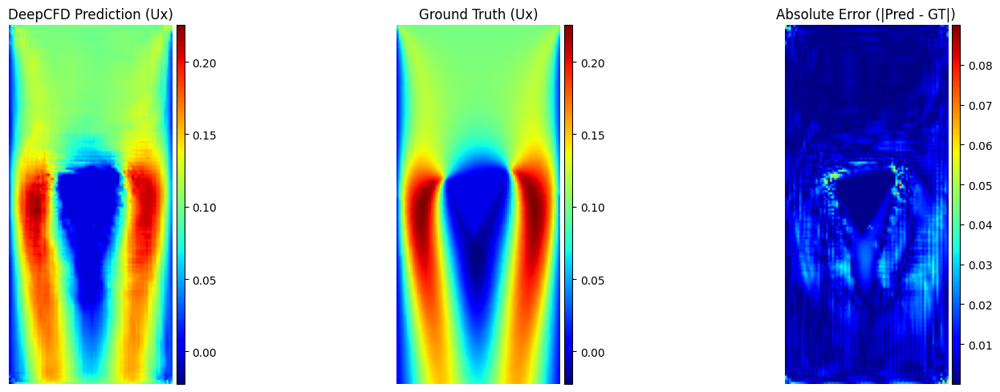

# DeepCFD-Keras (Extended)

This repository builds on the original DeepCFD framework by implementing additional custom model architectures and enhancements using Keras. It is structured to clearly separate reference models, custom work, and evaluation notes.

## 📁 Repository Structure

```plaintext
DeepCFD-Keras-main/
│
├── models/             # Original model implementations from the guide
│   ├── autoencoder.py
│   ├── unet.py
│   └── *.md            # Markdown descriptions of each architecture
│
├── MyModels/           # Your custom models and trained files
│   ├── Unet_3.py       # Modified UNet architecture
│   ├── deepcfdUx.py    # Your own code implementation
│   └── deepcfdUx.keras # Saved trained model
│
├── notes/              # Helpful notes and result images
│   ├── OpenFoam.md
│   ├── SDF.py
│   ├── *.png           # Visual results (r1.png, r2.png, r3.png, etc.)
│   ├── *.txt, *.py     # Scripts and explanations
│
├── README.md           # Project documentation (this file)
└── LICENSE             # License info
```

## 💡 What's Included

* **Original Architectures**: Found in the `models/` folder, includes AutoEncoder and UNet variations.
* **Custom Work**: In `MyModels/`, contains your own code and trained model (`deepcfdUx.keras`).
* **Notes & Results**: Visualizations and utility scripts for data processing, stored in `notes/`.

## 🧪 Results

The `notes/` folder includes key result images that demonstrate model performance:

* 
* 
* 

> These visuals represent qualitative outputs from different model configurations.

## 📌 Notes

* `how-may-compare-two-img.py`: Helper script for comparing image outputs.
* `notes-on-x-data.txt`: Observations or preprocessing notes on your dataset.
* `OpenFoam.md`: Notes related to CFD tools or preprocessing.
* `archi.png`, `data.png`: Architecture and dataset visualization.

## 🚀 Getting Started

To run your custom model:

```bash
python MyModels/deepcfdUx.py
```

To explore original implementations:

```bash
python models/autoencoder.py
python models/unet.py
```

## 🛠 Dependencies

Ensure you have TensorFlow/Keras and the required scientific libraries installed:

```bash
pip install tensorflow numpy matplotlib
```

## 📜 License

This project uses the same license as the original DeepCFD repository. See the `LICENSE` file for details.
